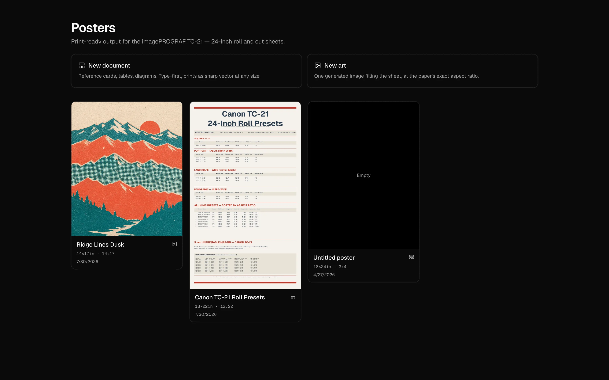
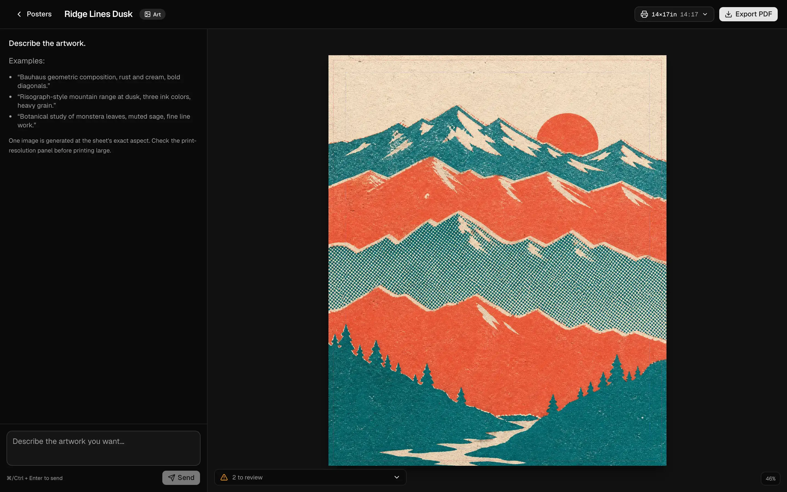
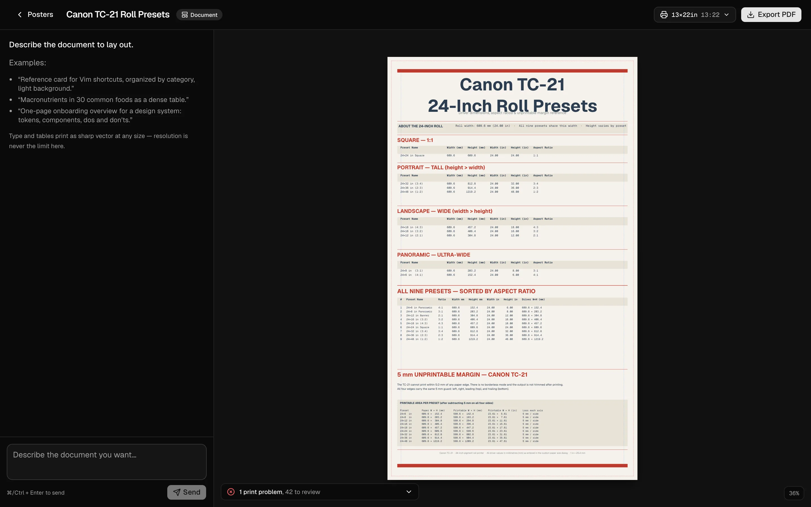

# PosterMaker

AI poster generation for print. A planner and orchestrator lay out a poster from a text brief, generate its assets, and export a print-ready PDF sized for the Canon imagePROGRAF TC-21 (24-inch roll and cut sheets).



**Live:** https://poster-maker-beta.vercel.app

## Screenshots



Art workspace: one generated image fills the sheet at the paper's aspect ratio, with print-readiness checks at the bottom.



Document workspace: type and tables render as vector, and the checks list print problems before export.

## Modes

- **Document:** reference cards, tables and diagrams, type-first.
- **Art:** a single generated image at the sheet's exact aspect ratio.

The two modes run different pipelines and have different print-readiness rules (`lib/poster/`).

## Stack

- Next.js 16 (App Router), React 19, Tailwind CSS 4, shadcn/ui
- Vercel AI SDK (`ai`, `@ai-sdk/react`) through the Vercel AI Gateway: `anthropic/claude-sonnet-4.6` plans, `openai/gpt-image-2` makes art, `google/gemini-3.1-flash-image-preview` makes illustrations (`lib/ai/gateway.ts`)
- Vercel Blob for projects, assets and exports
- `puppeteer-core` with `@sparticuz/chromium` for PDF export

## Run locally

```bash
npm install
vercel link
vercel env pull .env.local   # Blob token and AI Gateway credentials
npm run dev                  # http://localhost:3000
```

Other scripts: `npm run build`, `npm run start`, `npm run lint`. There is no test script.

Optional environment variables, all read in `app/api/export/route.ts`:

- `PUPPETEER_EXECUTABLE_PATH`: local Chrome for PDF export (common macOS and Linux paths are tried otherwise)
- `NEXT_PUBLIC_APP_ORIGIN`: origin the export browser loads the preview from
- `VERCEL_AUTOMATION_BYPASS_SECRET`: lets the export browser pass Vercel deployment protection

## File map

```
app/page.tsx        gallery and new-project cards
app/actions.ts      server actions (create project, change sheet)
app/p/[id]/         workspace and print preview routes
app/api/            orchestrate, export, upload, projects
lib/ai/             planner, orchestrator, asset generation, model config
lib/poster/         types, media sizes, rendering, storage, quality checks
components/         gallery, workspace and ui components
docs/superpowers/specs/   design notes (lenticular output)
```
